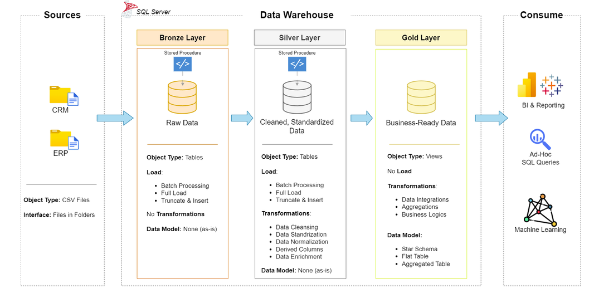

# SQL Data Warehouse Project

A SQL Server data warehouse project implementing an **ELT (Extract, Load, Transform)** pipeline
across a **Medallion Architecture** (Bronze → Silver → Gold). Raw CRM and ERP CSV exports are
loaded as-is, progressively cleaned and conformed, and finally exposed as a business-ready
**star schema** for BI, reporting and ad-hoc analysis.

## System Architecture



| Layer      | Object Type | Load                                  | Transformations                                                              | Data Model                     |
|------------|-------------|----------------------------------------|-------------------------------------------------------------------------------|---------------------------------|
| **Bronze** | Tables      | Batch, full load, truncate & insert    | None — raw data as-is                                                        | None (as-is)                    |
| **Silver** | Tables      | Batch, full load, truncate & insert    | Cleansing, standardization, normalization, derived columns, enrichment       | None (as-is)                    |
| **Gold**   | Views       | No load (query-time)                  | Data integration, aggregations, business logic                              | Star schema, flat/aggregated tables |

## Data Architecture

- **Bronze Layer** — raw data loaded straight from the source CSV files (`datasets/source_crm`,
  `datasets/source_erp`) with no transformations, preserving the data exactly as delivered by
  the source systems (including known dirty rows — see `scripts/bronze/ddl_bronze.sql`).
- **Silver Layer** — bronze data cleaned, standardized, deduplicated, and enriched with derived
  columns (e.g. `cat_id`, normalized categorical values, recalculated sales figures) so it is
  trustworthy and consistent, but still one table per source entity.
- **Gold Layer** — silver data integrated across CRM/ERP sources and reshaped into a star schema
  of business-ready views (dimensions + fact), ready to be consumed directly by BI tools,
  ad-hoc SQL queries, or ML pipelines. See `docs/data_catalog.md` for the full column-level
  documentation of every gold view.

## File Management

```
sql-data-warehouse-project/
│
├── datasets/                      # Raw source CSV files (input to the bronze layer)
│   ├── source_crm/                # CRM exports: cust_info, prd_info, sales_details
│   └── source_erp/                # ERP exports: CUST_AZ12, LOC_A101, PX_CAT_G1V2
│
├── docs/
│   └── data_catalog.md            # Column-level documentation of the gold layer views
│
├── scripts/                       # All version-controlled SQL for the warehouse
│   ├── init_database.sql          # Creates the DataWarehouse database + bronze/silver/gold schemas
│   ├── bronze/
│   │   ├── ddl_bronze.sql         # DROP + CREATE for all bronze tables
│   │   └── proc_load_bronze.sql   # bronze.load_bronze — BULK INSERT from CSV into bronze tables
│   ├── silver/
│   │   ├── ddl_silver.sql         # DROP + CREATE for all silver tables
│   │   └── proc_load_silver.sql   # silver.load_silver — cleans/transforms bronze into silver
│   └── gold/
│       └── ddl_gold.sql           # DROP + CREATE for the gold views (dim_customers, dim_products, fact_sales)
│
├── tests/
│   ├── quality_checks_silver.sql  # Data quality checks for the silver layer (0 rows = healthy)
│   └── quality_checks_gold.sql    # Data quality checks for the gold layer (0 rows = healthy)
│
├── SystemArhitecture.png          # Medallion architecture diagram
├── LICENSE
└── README.md
```

Each layer's DDL follows a **DROP-IF-EXISTS + CREATE** convention so scripts are idempotent
and safe to re-run, and each load procedure follows the naming convention `load_<layer>`
(e.g. `bronze.load_bronze`, `silver.load_silver`).

## How to Run

1. Run `scripts/init_database.sql` to create the `DataWarehouse` database and the
   `bronze` / `silver` / `gold` schemas.
2. Run `scripts/bronze/ddl_bronze.sql` and `scripts/bronze/proc_load_bronze.sql`, then
   `EXEC bronze.load_bronze;` to load the raw CSVs into the bronze layer.
3. Run `scripts/silver/ddl_silver.sql` and `scripts/silver/proc_load_silver.sql`, then
   `EXEC silver.load_silver;` to clean and load the silver layer.
4. Run `scripts/gold/ddl_gold.sql` to create the gold views.
5. Use `tests/quality_checks_silver.sql` and `tests/quality_checks_gold.sql` to validate
   data quality after each load — every query should return 0 rows.

## License

See [LICENSE](LICENSE).
